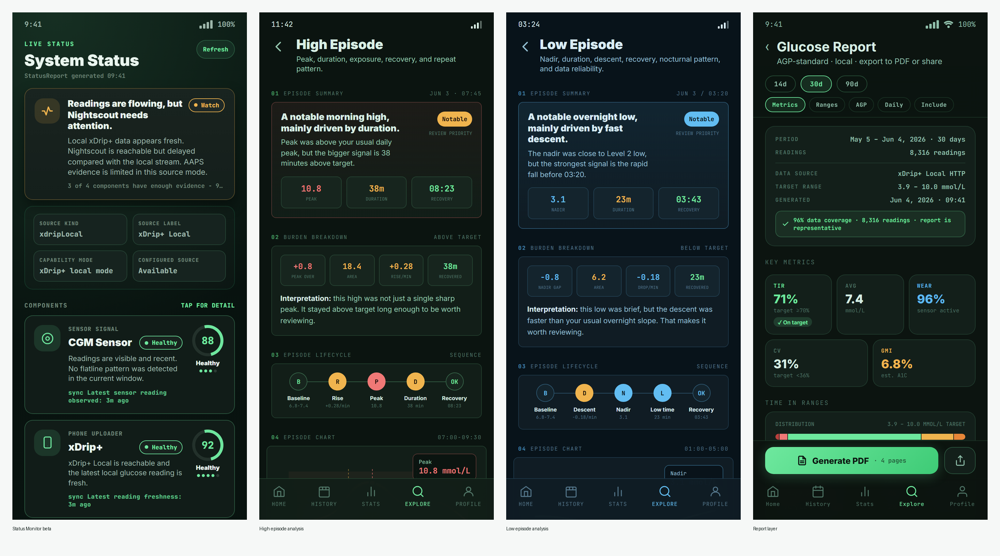
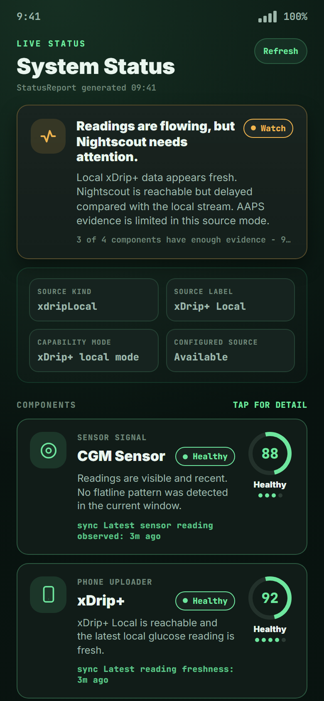
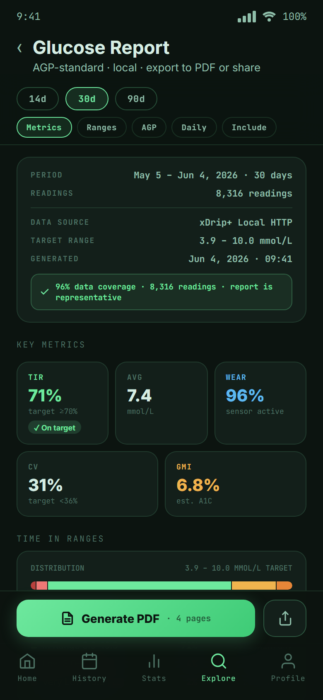
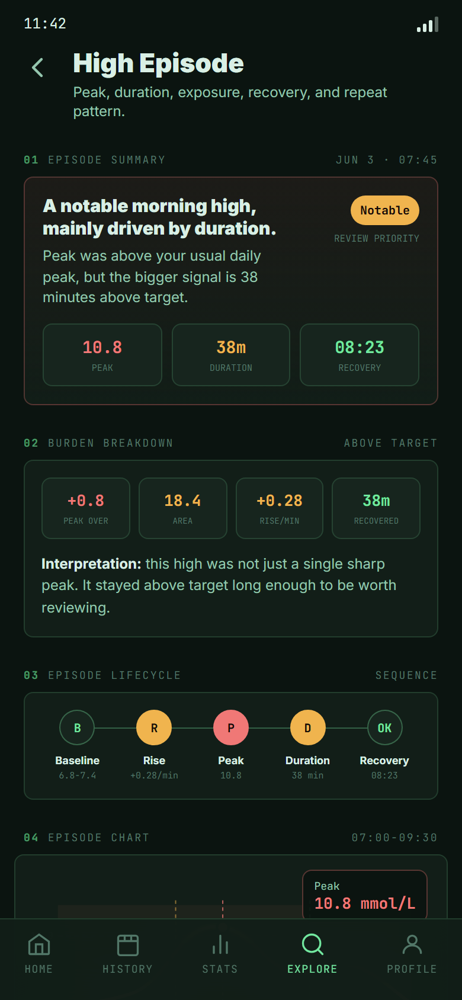
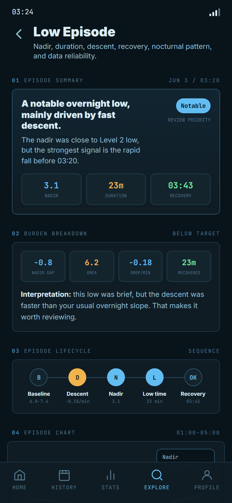
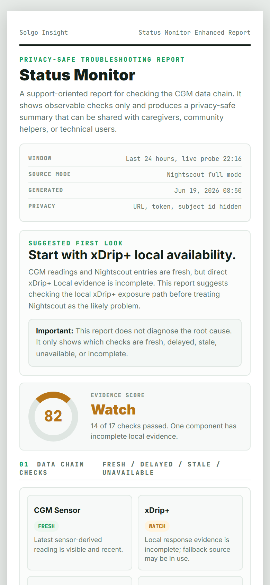

# Solgo Insight Community Preview

**Solgo Insight is an open-source CGM companion app for people who already use
[xDrip+](https://github.com/NightscoutFoundation/xDrip) and
[Nightscout](https://github.com/nightscout/cgm-remote-monitor).**

It helps users review, understand, and discuss the glucose data they already
collect. Solgo Insight is not an official xDrip+ project, not a fork of xDrip+,
and not a replacement for xDrip+, Nightscout, CGM manufacturer apps, pump
systems, or medical alert workflows.

> Previously published under an earlier preview name. The project was renamed
> to Solgo Insight to make its companion-app position clearer.

## Download

**Latest packaged Android APK:**  
https://github.com/solgosea/solgo-glucose-insight/releases/download/v0.4.0-community-preview/solgo-insight-community-preview-v0.4.0-android.apk

Latest packaged preview: **v0.4.0 Community Preview**

This repository branch now includes the next community-preview code update,
focused on multilingual foundations, report architecture, Low / High Episode
reporting, Status Monitor beta, and Float Widget sizing improvements.

## What This Update Adds

This update is not only a screen update. It introduces several foundations that
make Solgo Insight easier to grow from community feedback.

### 1. Multilingual Architecture

Solgo Insight now has a broader localization foundation for app-level text and
plugin-level text. The goal is to make future language support practical
without hardcoding every feature page.

This matters because many CGM users are not native English speakers, and the app
should become easier to understand across different communities.

### 2. Report Layer Architecture

The new Report Layer separates structured analysis data from the final output
format. Feature plugins can provide report snapshots, while the host app can
render them as app pages, PDF-ready views, shareable summaries, or future export
formats.

The direction is:

```text
Glucose Data
    |
    v
Analysis Engine
    |
    v
Report Snapshot
    |
    v
Report Runtime
    |
    v
App View / PDF / Share Summary
```

The report layer is designed for personal review and discussion. It does not
provide diagnosis, dosing advice, or treatment instructions.

### 3. Low / High Episode Report Analysis

Low Episode and High Episode analysis now move beyond a simple event list.

The new structure focuses on:

- episode duration
- peak or nadir
- recovery behavior
- repeat pattern
- burden and exposure
- reliability of the data window
- report-ready summaries

These views are intended to help users and caregivers discuss what happened,
not to replace clinical judgment.

### 4. Status Monitor Beta

Status Monitor beta is a troubleshooting-oriented plugin for users whose data
chain depends on several moving parts, for example:

```text
CGM sensor -> xDrip+ -> Nightscout -> other apps or followers
```

The beta version tries to make the chain less of a black box by checking whether
each part looks fresh, delayed, stale, or unavailable.

It is not an alarm system and not a diagnostic tool. It is a quick health-check
surface that can help users know where to look first.

### 5. Float Widget Sizing Improvements

The Float Widget / Glance Layer has been adjusted to support better sizing and
display behavior. This is based on community feedback that quick-glance surfaces
need to be readable, compact, and practical during daily use.

## Preview Screenshots



| Status Monitor beta | Glucose report |
| --- | --- |
|  |  |

| High Episode analysis | Low Episode analysis |
| --- | --- |
|  |  |

| Status Monitor report |
| --- |
|  |

## Current Public Preview Scope

The current public preview includes:

- Home view with current glucose, trend, range, TIR, and quick insights.
- History view with daily review, chart inspection, and high/low episode entry points.
- Stats view for TIR, variability, AGP-style overview, and selectable time windows.
- Insights view for readable glucose pattern summaries.
- High Episode and Low Episode analysis.
- Report Layer foundation and report-ready analysis pages.
- Status Monitor beta for data-chain troubleshooting.
- xDrip+ Local and Nightscout data source setup.
- Background sync foundation for keeping data fresh.
- Local glucose alert engine, disabled by default.
- Glance Layer: Android widgets, floating glance, and lock-screen friendly notification text.

The public repository intentionally does **not** include unreleased or
experimental plugins outside this preview scope.

## Architecture

Solgo Insight is built around a **host + plugin architecture**.

The host app provides shared foundations such as data source coordination,
sync runtime, local storage, app settings, unit conversion, plugin lifecycle,
background runtime, alert runtime foundation, localization, and report runtime.

Feature plugins then build user-facing experiences on top of those shared
services.


For more details, see [Architecture Notes](docs/architecture.md).

## Data Source Setup

Solgo Insight can use xDrip+ Local or Nightscout as data sources.

For xDrip+ Local setup, see the
[xDrip+ Local Connection Guide](docs/xdrip-local-connection-guide.md).

## Community

Solgo Insight is shaped by community feedback.

Join the Reddit community to share feedback, report issues, discuss feature
ideas, and follow updates:

https://www.reddit.com/r/SolgoInsight/

## Demo

**Demo video:**  
https://www.youtube.com/watch?v=UfjxgaeEwZA

**Playlist:**  
https://www.youtube.com/watch?v=QZl0NSckXYI&list=PLKDhx_9jUu-74px9PGC62dwRQwsXWhLxi

## FAQ

Have questions about local xDrip+ data, Nightscout, widget sizes, delta
differences, or whether Solgo Insight replaces xDrip+?

See the [Solgo Insight FAQ](docs/faq.md).

## Privacy

- No Solgo Insight account is required for the community preview.
- Glucose data is stored locally on the device.
- Network calls are made only to data sources you configure, such as xDrip+
  Local or your own Nightscout site.
- This repository does not include telemetry or advertising SDKs.

## Medical Disclaimer

Solgo Insight is not a medical device. It is for personal data review,
education, and community feedback. Do not make treatment decisions based only
on this app. Always follow your care plan and consult qualified healthcare
professionals.

## Development

```bash
flutter pub get
flutter run -d android
```

This public preview is Android-first.
