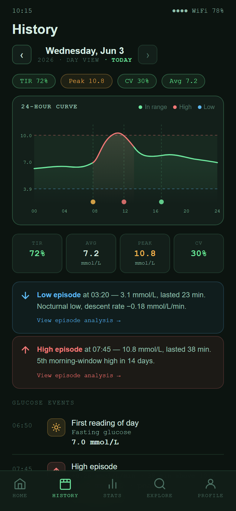
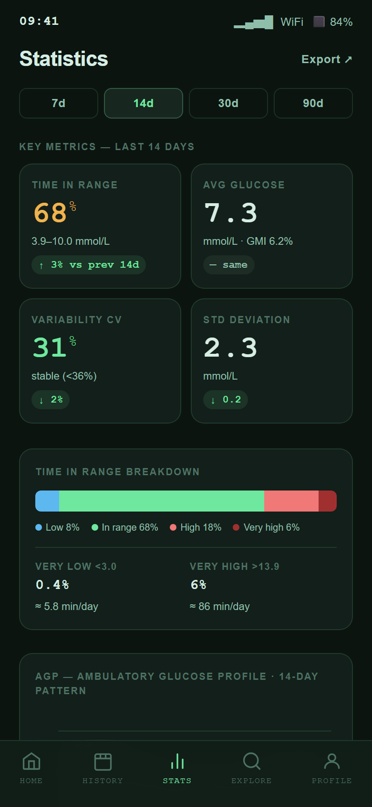
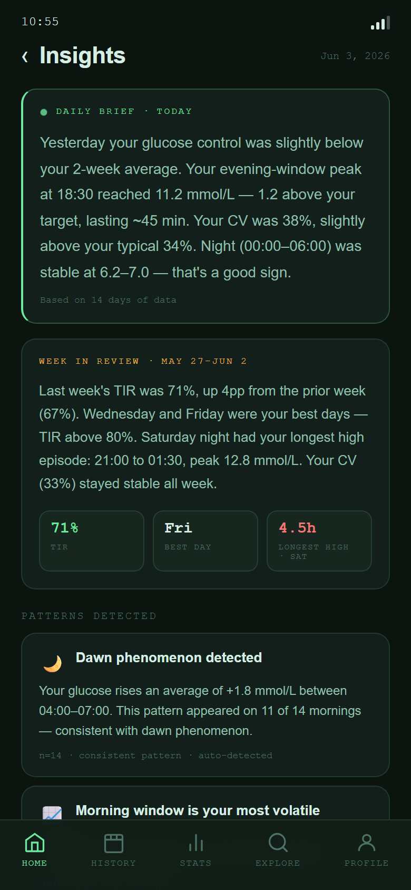

# SmartXDrip Community Preview

## Already using [xDrip+](https://github.com/NightscoutFoundation/xDrip) or [Nightscout](https://nightscout.github.io/)?

SmartXDrip is a companion app for CGM review, analysis, and local helper reminders. It is built for people who already rely on [xDrip+](https://github.com/NightscoutFoundation/xDrip) and [Nightscout](https://nightscout.github.io/) as valuable parts of their CGM workflow.

SmartXDrip does not replace either project. xDrip+ and Nightscout remain the source of truth for CGM data. SmartXDrip reads from the user's configured source and adds a focused workspace for daily review, historical context, statistics, insights, episode review, and local alerting experiments.

View the product documentation site:

```text
https://solgosea.github.io/smartxdrip-docs/
```

## First public scope

This community preview currently focuses on:

- **Home** - current glucose, trend, Time in Range, recent curve, insight banner, and sync status
- **Insights** - plain-language daily and weekly review prompts
- **History** - day-by-day CGM review with high and low event entry points
- **High Episode** - focused review of a sustained high glucose event
- **Low Episode** - focused review of a sustained low glucose event
- **Stats** - Time in Range, average glucose, variability, AGP, and range breakdown
- **Data Source** - xDrip+ Local on Android and Nightscout API
- **Background Sync** - Android-first sync runtime and source health tasks
- **Settings** - display, target range, storage, sync, and app information
- **Alerting Core** - local glucose reminder rules, notification, sound, vibration, and snooze foundations

This preview intentionally keeps the first public feature set focused. Future features should be shaped step by step based on community feedback and real user needs.

## Preview Screens

<table>
  <tr>
    <td align="center"><strong>Home</strong></td>
    <td align="center"><strong>History</strong></td>
    <td align="center"><strong>Stats</strong></td>
  </tr>
  <tr>
    <td></td>
    <td></td>
    <td></td>
  </tr>
</table>

<table>
  <tr>
    <td align="center"><strong>Insights</strong></td>
    <td align="center"><strong>High Episode</strong></td>
    <td align="center"><strong>Low Episode</strong></td>
  </tr>
  <tr>
    <td></td>
    <td></td>
    <td></td>
  </tr>
</table>

## Why this exists

[xDrip+](https://github.com/NightscoutFoundation/xDrip) and [Nightscout](https://nightscout.github.io/) have created a strong foundation for CGM users: data collection, device workflows, alerts, uploads, sharing, and user-controlled access to glucose data.

SmartXDrip starts from respect for that foundation. The goal is to explore a companion workspace that helps users review and interpret the CGM data they already collect.

The app is designed to help answer:

- What is happening with my glucose right now?
- What happened on a difficult day?
- Which high or low event deserves closer review?
- Are Time in Range, average glucose, and variability changing?
- Are there repeated patterns worth noticing?
- Is my data source fresh and still syncing?

## Data Sources

SmartXDrip can read from:

- **xDrip+ Local Web Service** on Android
- **Nightscout API** through a user-provided URL and readable token

SmartXDrip does not read CGM sensors directly. xDrip+ or Nightscout remains the source of truth.

If a Nightscout URL has no scheme, SmartXDrip normalizes it automatically. Public hosts default to `https://`; local and private network hosts default to `http://`.

## Platform Status

This preview is Android-first.

- Android supports xDrip+ Local, Nightscout, local storage, foreground/background sync foundations, and Alerting Core experiments.
- iOS is a planned Nightscout-first direction. The UI and analysis layers are largely portable, but iOS background sync and helper alerts need a dedicated design because iOS controls background execution differently from Android.

## What this is not

SmartXDrip is not intended to:

- Replace [xDrip+](https://github.com/NightscoutFoundation/xDrip)
- Replace [Nightscout](https://nightscout.github.io/)
- Read CGM sensors directly
- Replace existing alert and safety workflows
- Make treatment recommendations
- Provide medical advice

SmartXDrip should work alongside the existing tools users already trust, not ask users to move away from them.

## Repository Scope

This repository contains the SmartXDrip community preview source code.

It includes the first public Flutter app scope, plugin architecture, local analysis code, data source integration, background sync foundations, Alerting Core foundations, tests, and supporting documentation.

It does not include unrelated internal prototype modules that are outside the first public preview.

## Running Locally

```bash
flutter pub get
flutter run -d android
```

For web preview during development:

```bash
flutter run -d chrome
```

## xDrip+ Local Setup

In xDrip+ on Android:

1. Open Settings.
2. Enable the local Web Service.
3. Configure an API secret if your setup requires one.
4. Use the local xDrip+ URL in SmartXDrip.

## Nightscout Setup

In SmartXDrip:

1. Open Profile.
2. Configure Nightscout as a data source.
3. Enter your Nightscout site URL and readable token.

## Testing

```bash
flutter test
flutter analyze
```

## Privacy

- No SmartXDrip-operated glucose data cloud in this preview.
- No required account.
- Glucose data is stored locally.
- Outbound calls are made only to user-configured xDrip+ or Nightscout sources.
- API secrets are stored through secure platform storage.

## Feedback Wanted

The first public review focuses on:

- Whether this companion workflow feels useful to xDrip+ and Nightscout users
- Whether Home, Insights, History, Episode Detail, and Stats are the right starting point
- Which alerting and sync behavior users would expect from a companion app
- Which details feel useful, confusing, or unnecessary
- Where SmartXDrip should stop so it does not duplicate existing tools

Join the discussion:

- [What would you want to see first when opening a CGM review app?](https://github.com/solgosea/smartxdrip-docs/discussions/1)
- [How do you review a difficult CGM day after it happens?](https://github.com/solgosea/smartxdrip-docs/discussions/2)
- [Which CGM statistics actually help you understand your patterns?](https://github.com/solgosea/smartxdrip-docs/discussions/3)

## Medical Disclaimer

SmartXDrip is a personal data review tool, not a medical device. It does not diagnose, treat, cure, or prevent disease. It does not provide medical advice.

Do not make treatment, medication, or dietary decisions based solely on information shown by the app. Always consult a qualified healthcare professional.
