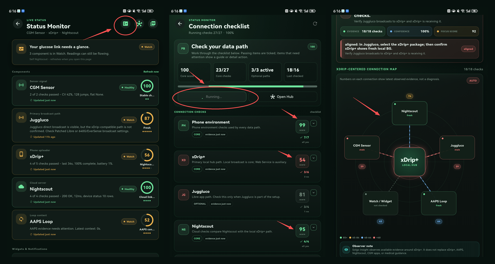

# Solgo Insight Community Preview

> **Not a medical device.** Solgo Insight is a personal CGM companion app for review, troubleshooting, and daily data understanding. It does not diagnose, treat, cure, or prevent disease. Do not make treatment decisions based only on this app. Always use your CGM official app, xDrip+, Nightscout, pump/AAPS tools, and professional medical advice as appropriate.

Solgo Insight is built as a companion around the glucose data people already collect through tools such as **xDrip+** and **Nightscout**. The community preview focuses on making that data easier to review, explain, and troubleshoot without replacing the collector or existing diabetes workflow.

## Download

Latest community preview:

**Android APK:** https://github.com/solgosea/solgo-glucose-insight/releases/download/v0.6.0/solgo-insight-community-preview-v0.6.0-android.apk

If Android blocks the APK, uninstalling an older preview build may be required before installing the new one. Local app settings may be removed by uninstalling, but glucose history can be synced again from the configured source.

## Preview



## v0.6.0 Major Update

This release is a major update around three areas:

### Smart Sync

The data sync layer has been optimized again. Solgo Insight can switch sync behavior based on time windows, perform incremental sync for recent data, and use the sync window configured in Settings.

This gives Home, History, Stats, Reports, and Status Monitor a more consistent data foundation.

### Smart Date Selection

Date selection has been updated across the app. Common review windows and custom date ranges are handled through a more consistent shared model, so analysis and report pages can feel less fragmented.

### Status Monitor

Status Monitor is now implemented as a complete beta feature:

- probe setup
- xDrip-centered connection health analysis
- component-level monitoring
- Status Monitor report output
- support for practical checks around xDrip+, Nightscout, Juggluco, AAPS, and watch display paths where evidence is available

The purpose is to help users understand where to look first when the glucose data chain stops working or becomes delayed.

Read the full release notes: [Solgo Insight v0.6.0 Major Update](docs/releases/v0.6.0.md)

## Included Preview Scope

- **Home / History / Stats**: core daily glucose review surfaces.
- **High / Low Episode review**: richer episode analysis and report-ready summaries.
- **Report Layer**: structured reports for review and sharing.
- **Glance surfaces**: Android widgets, floating glance improvements, and compact status surfaces.
- **Local alerts**: on-device glucose alert support.
- **Multilingual architecture**: foundation for wider language support.

## Product Direction

Solgo Insight is not trying to become a new CGM collector in this preview. The goal is to sit beside existing ecosystem tools and help users understand:

- Is my latest glucose value fresh?
- Where did the data come from?
- Did xDrip+ receive local data?
- Is Nightscout reachable or delayed?
- Are downstream tools such as watch displays or AAPS likely receiving usable data?
- What happened during recent high or low episodes?

The long-term direction is a companion layer for daily review, caregiver support, troubleshooting, and practical insight.

## Privacy

- No account is required for the community preview.
- Glucose data is stored locally on the device.
- Network calls are made only to data sources the user configures, such as their own Nightscout URL or local xDrip+ endpoint.
- API secrets are stored with platform secure storage where supported.
- Users choose what to export or share.

## Data Sources

Supported preview paths include:

- xDrip+ Local / xDrip+ service evidence where available
- Nightscout API
- Juggluco-related evidence for Status Monitor scenarios
- Built-in mock/demo data for development and testing

The exact available checks depend on how each external app is configured.

## Build From Source

```bash
flutter pub get
flutter run -d android
```

For release signing, copy:

```text
android/key.properties.example
```

to:

```text
android/key.properties
```

and fill in your own local signing values. Do not commit private signing files.

## Project Scope

This repository contains the public community preview scope. Some experimental or internal modules are intentionally not included in this build. The current public scope is centered on glucose review, high/low episode analysis, reporting, local alerts, glance surfaces, and Status Monitor beta.

## Respect For The Ecosystem

Solgo Insight depends on the work and ideas of the wider diabetes technology community. It is designed to complement, not replace, projects such as xDrip+, Nightscout, AAPS, Juggluco, WatchDrip, and CGM manufacturer apps.
