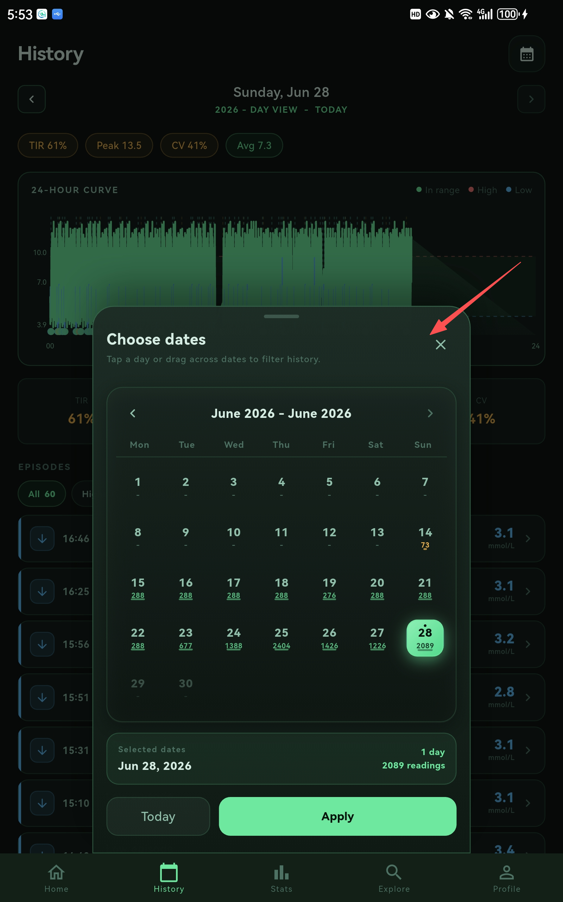
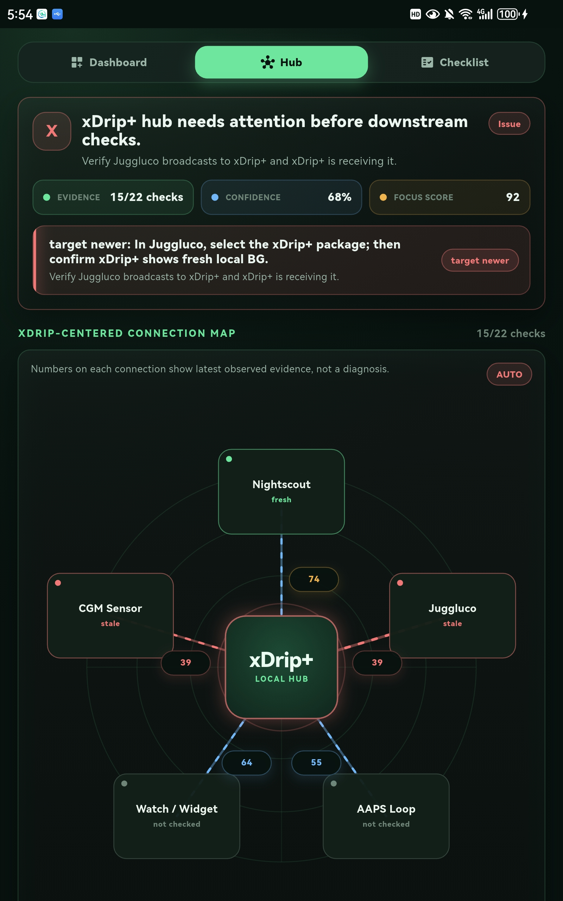
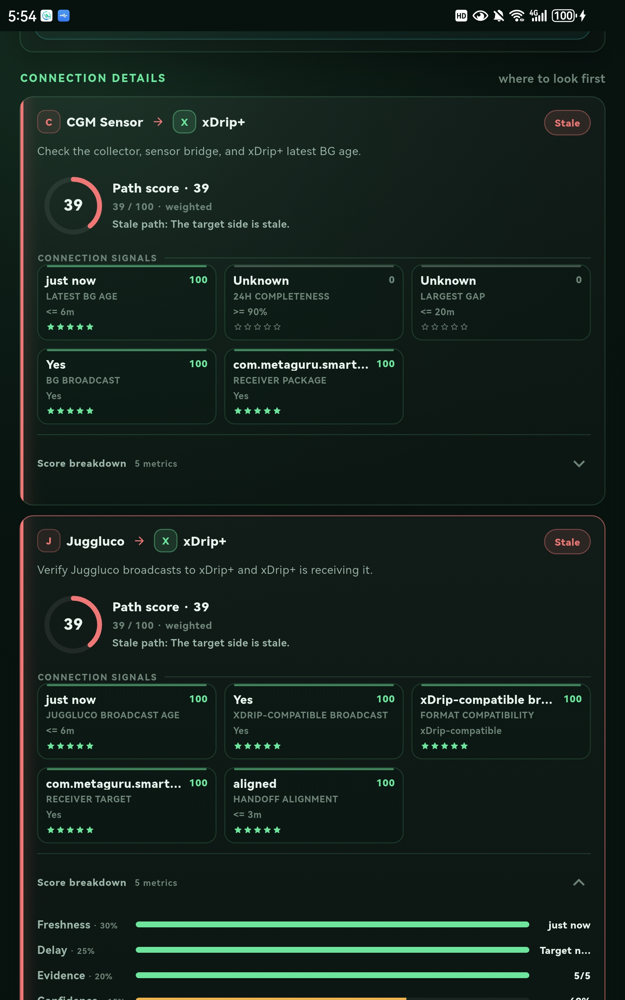
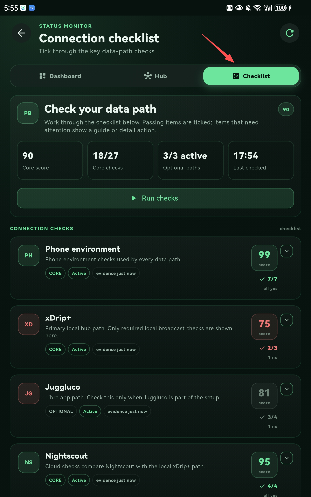
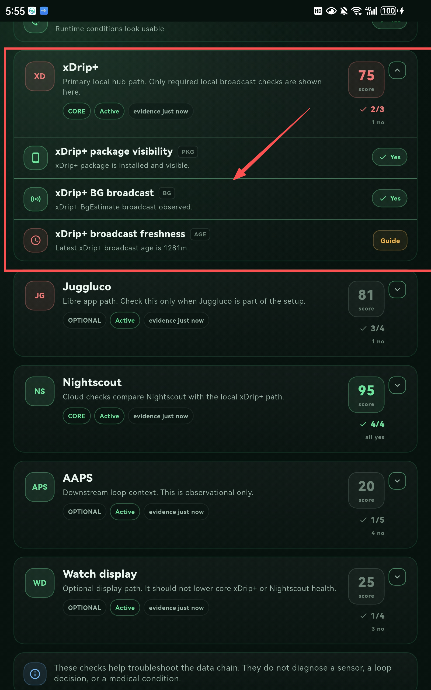
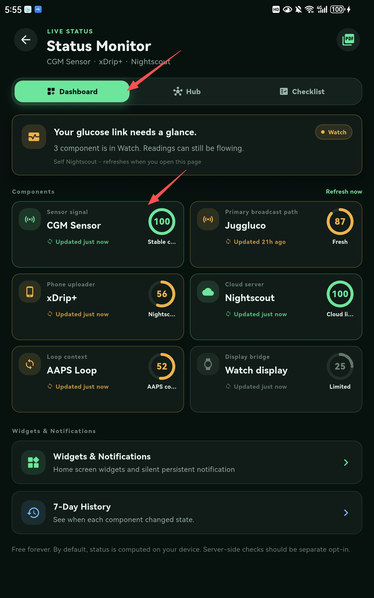

# Solgo Insight v0.6.0 Major Update

Release date: 2026-06-28

Solgo Insight v0.6.0 is a major community preview update. This release is not only a UI update; it changes how the app synchronizes data, how users select time ranges, and how the Status Monitor understands the glucose data chain.

> **The goal is simple: make glucose data easier to sync, easier to review, and easier to troubleshoot when something stops working.**

## 1. Smart Sync

The sync layer has been optimized again around real daily use.

### What changed

- The app can switch sync behavior based on the selected time window.
- Recent data can be synced incrementally instead of repeatedly fetching the same large range.
- Sync windows can follow the user's Settings configuration.
- The sync runtime is better separated from UI pages, so Home, History, Stats, Reports, and Status Monitor can share a more consistent data foundation.

### Why it matters

CGM users do not always need the same sync strategy:

- Home needs fresh recent readings.
- History needs enough data for review.
- Reports may need a longer window.
- Status Monitor needs to know whether a source is fresh, delayed, stale, or unavailable.

Smart Sync is designed to make those needs work together without forcing every screen to fetch data in the same way.

## 2. Smart Date Selection

Date selection has been updated across the app.

### What changed

- Date-related screens now use a more consistent smart date selection model.
- Users can switch common windows more easily.
- Date filters are shared more cleanly across analysis and report surfaces.
- The UI is designed to reduce the friction of moving between daily review, short-term review, and longer report windows.

### Why it matters

Many users do not review glucose data in only one fixed window. They may want:

- today
- 24 hours
- 3 days
- 7 days
- 14 days
- 30 days
- a custom review window

Smart Date Selection makes this easier to support across multiple plugins without each screen inventing its own date logic.

## 3. Status Monitor

Status Monitor has been completed as a full beta feature for this public preview.

This is the largest functional change in v0.6.0.

### What changed

Status Monitor now covers three layers:

- **Probe setup**: help users check whether Solgo Insight can observe useful evidence from the data chain.
- **Connection health analysis**: compare how components relate to each other, especially around xDrip-centered workflows.
- **Component-level monitoring**: review each component's own state, evidence, freshness, delay, and possible next step.

The current beta is designed around common community setups such as:

- CGM / sensor data source
- Juggluco
- xDrip+
- Nightscout
- AAPS
- WatchDrip / watch display paths

The app does not claim to solve every issue automatically. Instead, it tries to reduce the "black box" feeling when readings stop updating or one part of the chain appears delayed.

### Why it matters

When a glucose setup stops working, many users need to answer one practical question first:

**Where should I look first?**

Status Monitor is designed to help with that question. It does not replace xDrip+, Nightscout, AAPS, Juggluco, WatchDrip, or official CGM apps. It tries to provide a practical health check around the setup the user already has.

## Other Included Improvements

- High / Low Episode review and report support.
- Report Layer foundation for structured review and sharing.
- Floating widget sizing improvements.
- Multilingual architecture foundation.
- Public preview cleanup so unreleased internal modules are not part of this repository release.

## Important Notes

Solgo Insight is a companion app and not a medical device.

- It is not a CGM collector replacement in this community preview.
- It does not provide diagnosis, treatment, insulin dosing, or clinical decision support.
- It should not replace xDrip+, Nightscout, AAPS, CGM manufacturer apps, pump tools, or professional medical advice.
- Status Monitor is still beta and will continue to improve based on real user feedback.
